# Microservices deployment on Kubernetes.

## Project Overview
I have created 2 microservices, containerized them using docker and deployed them on Kubernetes cluster (GKE), using CI/CD and registry for containers. The Infrastructer as Code (IaC) approach is used for creating a k8s cluster. 

## Overview and Set-up video
https://youtu.be/hF0YCRg2MXw

## Table of Contents
  - [Technology Overview](#technology-overview)
  - [Architecture](#architecture)
  - [Flow of Execution](#flow-of-execution)
  - [Part-1: Project Setup Steps](#part-1-project-setup-steps)
    - [1. Setup GCP Source Repositories](#1-setup-gcp-source-repositories)
    - [2. Setup CI/CD Pipeline in GCP Cloud build](#2-setup-cicd-pipeline-in-gcp-cloud-build)
    - [3. Setup Artifact Registry in GCP](#3-setup-artifact-registry-in-gcp)
    - [4. Use Terraform, to create a k8s cluster in GKE](#4-use-terraform-to-create-a-k8s-cluster-in-gke)
  - [Part-2: Deploying the microservices to k8s](#part-2-deploying-the-microservices-to-k8s)
  - [Extras](#extras)
  - [Notes](#notes)


## Technology Overview
 - For creating **microservices**: `python and flask` was used. 
 - For **containerization**: `Docker` 
 - For **CI/CD**: `GCP Cloud Build` 
 - For **container registry**: `GCP Artifact Registry` 
 - For **k8s cluster**: `Google Kubernetes Engine (GKE)` 
 - For **Infrastructure as Code (IaC)**: `Terraform` 
 - Additionally, `GCP Source Repository` was used
   for version control.

## Architecture

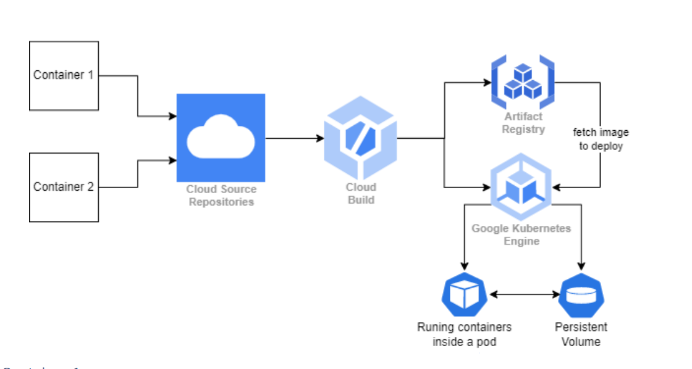

A cluster with 1 node is being used.
The node will run 2 PODs with 1 container in each. One of microservice-1 and another of microservice-2.

POD of microservice-1 is exposed outside the cluster, via Loadbalancer service.

POD of microservice-2 is exposed just inside the cluster via ClusterIP service so that microservice-1 can make calls.

A persistent volume is created using a persistent volume chain which uses the storage class provided by GCP. This volume is shared between both microservices.


## Flow of Execution
Whenever a commit is pushed in any microservice-specific repository in GCP Source Repository, the CI/CD pipeline will trigger in the GCP Cloud Build, which will first build the docker image, push it to the GCP artifact registry and then deploy it to the k8s cluster using the manifest files (YAML files).

## Part-1: Project Setup Steps

 ### 1. Setup GCP Source Repositories

1.1 Create a repository on GCP Source Repository for *Microservice 1* with name "`k8s-assignment-app1`" and copy the folder contents of "`k8s-assignment-app1`" to the newly created repository. 

1.2 Again, create a repository on GCP Source Repository for *Microservice 2* with name "`k8s-assignment-app2`" and copy the folder contents of "`k8s-assignment-app2`" to the newly created repository.

You should now have 2 repositories as shown below:
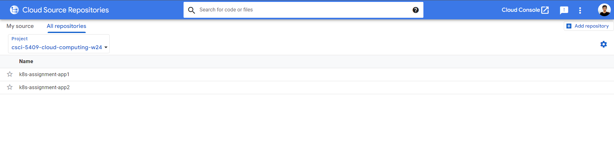

 ### 2. Setup CI/CD Pipeline in GCP Cloud build

2.1 Create a trigger for *Microservice 1* with following settings:

- Trigger Name: `k8s-assignment-app1-trigger`
- Region: `global`
- Event: `Push to a branch`
- Select Repository: `k8s-assignment-app1`
- Branch: `^master$`
- Configuration: Cloud Build configuration file (YAML or JSON)
- Location: `/cloudbuild.yaml`

Configurations should look like below:

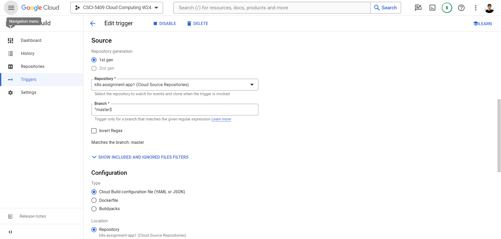
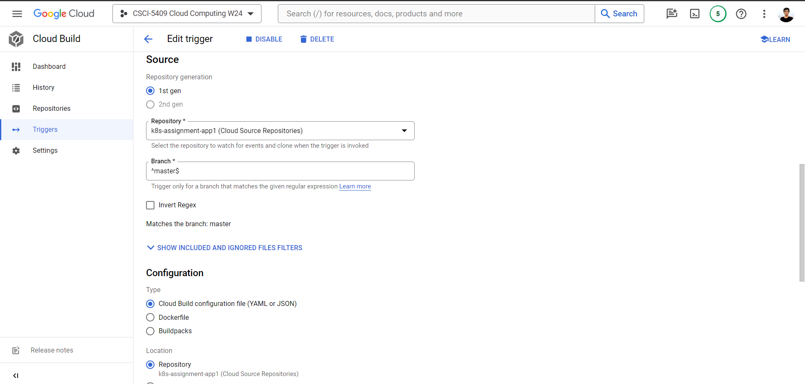
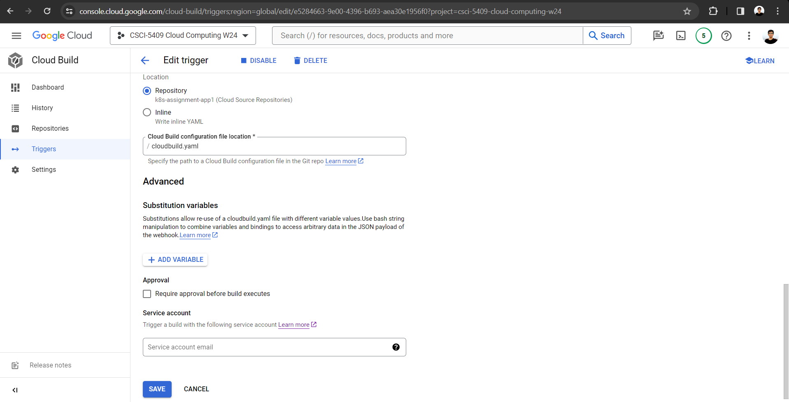

2.2 Similarly, create a trigger for *Microservice 2* with following settings:

- Trigger Name: `k8s-assignment-app2-trigger`
- Region: `global`
- Event: `Push to a branch`
- Select Repository: `k8s-assignment-app2`
- Branch: `^master$`
- Configuration: Cloud Build configuration file (YAML or JSON)
- Location: `/cloudbuild.yaml`

 ### 3. Setup Artifact Registry in GCP

Create a repository in the GCP Artifact registry, so that the CI/CD can push the images after build. These images can be later used for deployment, rollbacks and investigation if needed.

 Use the following settings:

 - Name: `k8s-assignment`
 - Format: `docker`
 - Mode: `standard`
 - Location Type: `Multi-Region > us`
 - Keep default settings for everything else.

After creation, it should look like below:

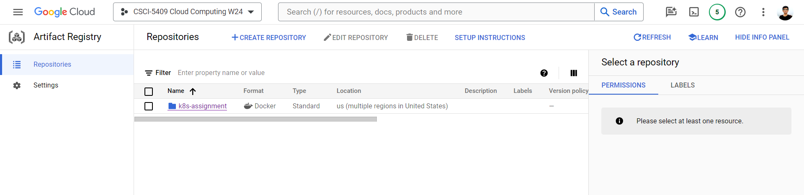

 ### 4. Use Terraform, to create a k8s cluster in GKE

 4.1 Open Cloud shell in GCP, copy the terraform folder from this repository and upload there.

 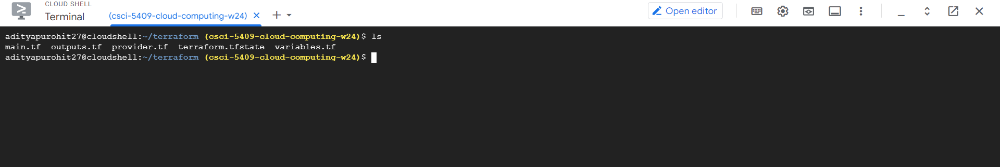

 4.2 Run `terraform init` in the folder where all .tf files are there, to install the providers/plugins that are required. Here, `google` is the provider of version `5.20.0` being used.

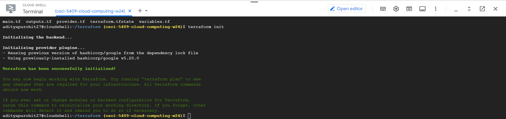

 4.3 Run `terraform apply` in the folder where all .tf files are there and type `yes`, if the plan shown by the terraform looks good.

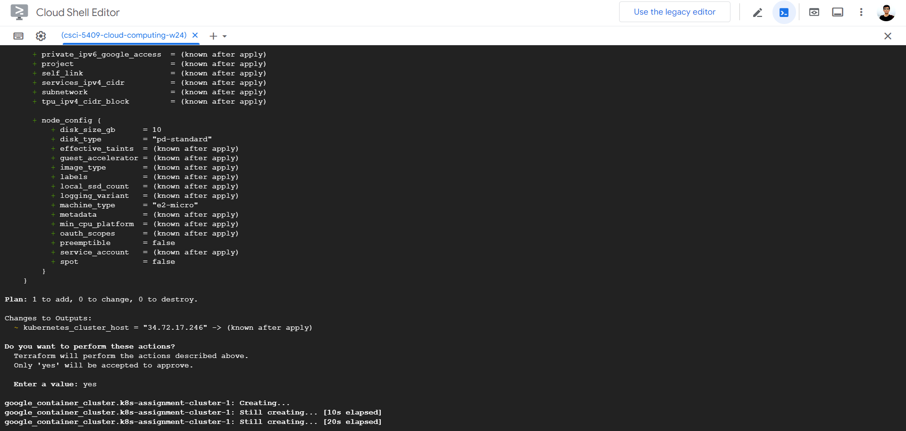

After 5-6 mins, the cluster should be created successfully.

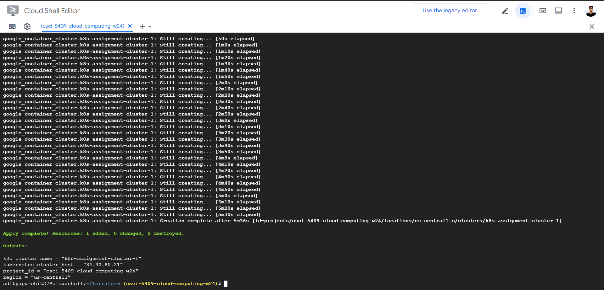

## Part-2: Deploying the microservices to k8s

Push a change to the repository of any microservice, which will automatically trigger the CI/CD and it will build, push and deploy the containers of the latest docker image in the k8s cluster.

Following are some sample pictures which show the flow after the commit is pushed:

1. CI/CD Pipeline will get triggered and will be completed in a few mins.
   
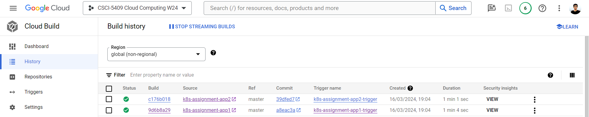

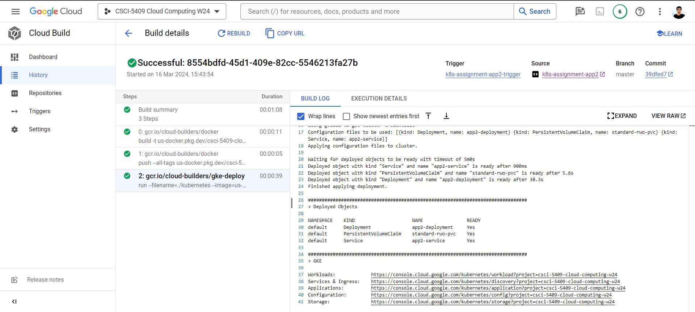

2. Latest image(s) of the microservices can be seen in the artifact repository as they were pushed by CI/CD.

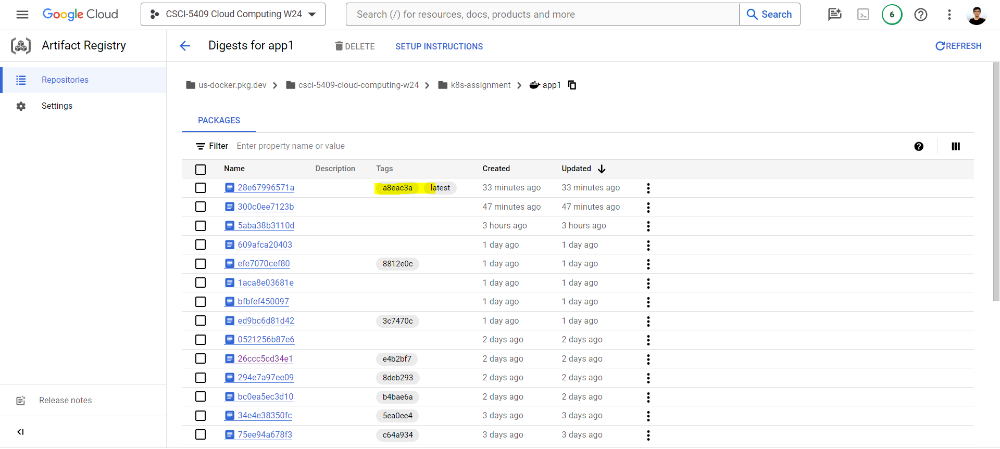


3. The workload can be seen as running in the GKE, as it was deployed by the pipeline using manifest files.

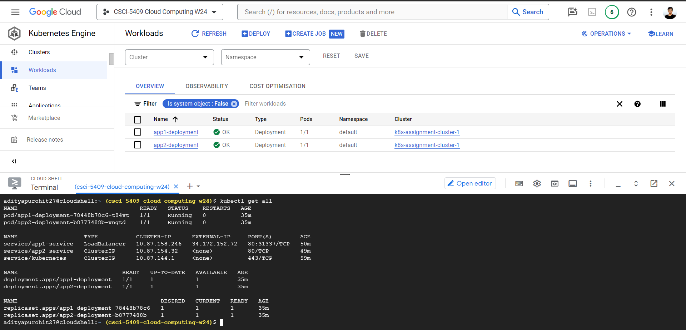


## Extras

To check the contents of the persistent volume, just open a shell in any container(inside the pod). Run the below in the GCP cloud shell.

```console 
kubectl exec -it <pod-name> -- sh

ls /Aditya_PV_dir

```

## Notes

 - **Submitted by**: Aditya Maheshbhai Purohit (aditya.purohit@dal.ca)
B00952865

- **For**: CSCI 5409 Cloud Computing – Winter 2024 - Kubernetes Assignment.
